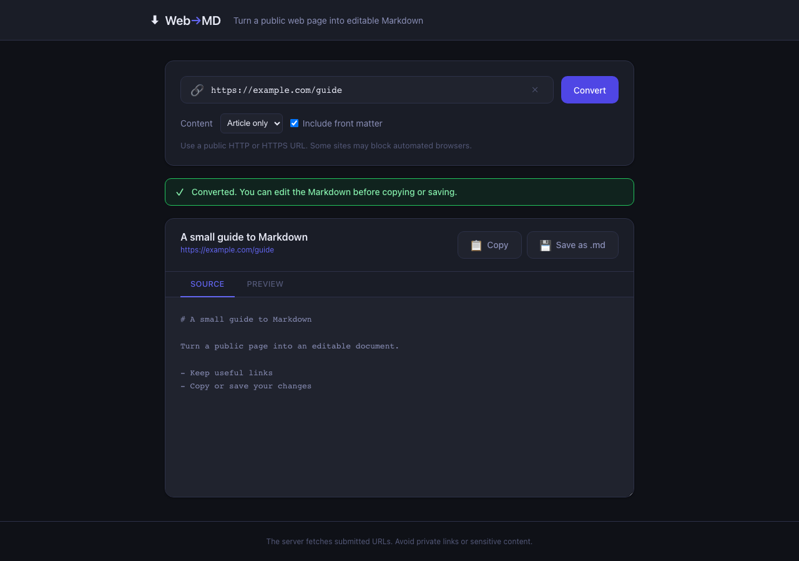

# Website → Markdown

Convert one public web page into editable Markdown. The web app and CLI share a Playwright → Readability → Turndown pipeline. Choose the main article or the full page, inspect the result, then copy or save it.



## Quick start

Requires Node.js 20+ and Playwright Chromium.

```sh
npm ci
npm run install:browser
npm start
```

Open <http://localhost:3000>. Paste a public `http://` or `https://` URL, choose **Article only** or **Full page**, and decide whether to include front matter. Edit the Markdown in the Source tab before copying or saving. The Preview tab uses a small escaping renderer; the saved Markdown is the editable source.

## CLI

```sh
node src/cli.js https://example.com/article --output article.md
node src/cli.js https://example.com/docs --full --no-front-matter > docs.md
```

`--output` refuses to overwrite an existing file. Without it, Markdown goes to stdout. Errors go to stderr with a nonzero exit code.

## Architecture

The Express app serves a static frontend and `POST /api/convert`. Both it and the CLI call `convertUrlToMarkdown`. The fetch layer resolves each hostname, rejects nonpublic answers, pins an approved IP for the connection, and checks every redirect. Playwright routes document and subresource requests through that same fetch layer. Readability extracts the article; if it finds none, conversion falls back to the page body. Turndown produces GFM tables and fenced code blocks. Front matter uses YAML-compatible escaped strings.

A conversion is limited to 30 seconds, 80 requests, 2 MB per resource, 4 MB rendered HTML, 12 MB aggregate downloads, and 2 MB Markdown output. The web server allows two active conversions and ten conversion requests per client IP per minute. Chromium JavaScript heap is limited to 128 MB; the server checks its own RSS before accepting work. For public deployment, also set an OS/container memory limit and outbound network policy.

## Security and privacy

Submitted URLs and page content are untrusted. The converter accepts only public HTTP(S) URLs on standard ports, rejects private and special IP ranges and mixed DNS answers, and checks redirects and browser resource requests. Browser service workers and WebSockets are disabled. Browser contexts are closed after each request. The preview escapes HTML and admits only HTTP(S) image and link targets. A restrictive Content Security Policy protects the app UI.

The server **does** receive submitted URLs and fetch page content. Do not submit private or sensitive links. A public host should also enforce egress rules denying private and metadata networks, isolate the worker in a container, set a hard memory cap, place rate limiting at the edge, and review logging/retention. Application checks alone are not a substitute for network isolation.

## Deployment note

This repository is ready for local use and a separately hosted browser worker; it is not configured as a Vercel Function. Vercel's [Function limits](https://vercel.com/docs/functions/limitations) include a 250 MB uncompressed bundle limit and 2 GB Hobby memory limit. Chromium installation and runtime behavior make fitting this complete Express/Playwright worker into a Function impractical without a separate binary/package strategy and deployment testing. A sensible design is to host `public/` on Vercel and run the Express API in a container with Chromium, egress firewall rules, CPU and memory quotas, TLS, and edge rate limiting. Set the frontend API base URL and CORS/CSRF policy for that split deployment before publishing it. This repository does not claim a working Vercel deployment.

## Limitations

This converts a single page. It does not crawl a site or access authenticated sessions. Sites may block automation, require interaction, rely on unsupported network APIs, or render content after the bounded readiness window. The preview supports common Markdown constructs and escapes the rest; it does not fully render every GFM extension. Large pages and inaccessible URLs return an error. A ZIP batch exporter is not included: concurrent browser jobs and archives would need separate quotas and admission controls before being suitable for a public demo.

## Development

```sh
npm run dev
npm run check
npm run format
```

`npm run check` runs syntax linting, whitespace formatting checks, local fixture tests, API tests, and a Playwright UI test. CI installs Chromium and runs the same gate. Tests use local HTML and a loopback server, so they do not depend on live sites.

See [CONTRIBUTING.md](CONTRIBUTING.md), [SECURITY.md](SECURITY.md), and [CHANGELOG.md](CHANGELOG.md). Licensed under [MIT](LICENSE).
